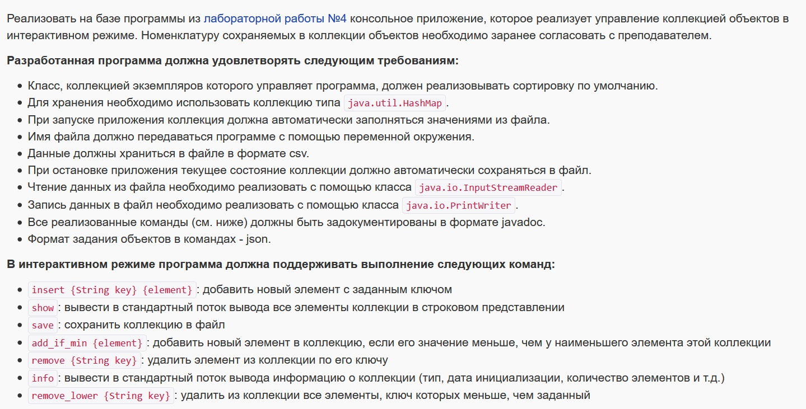
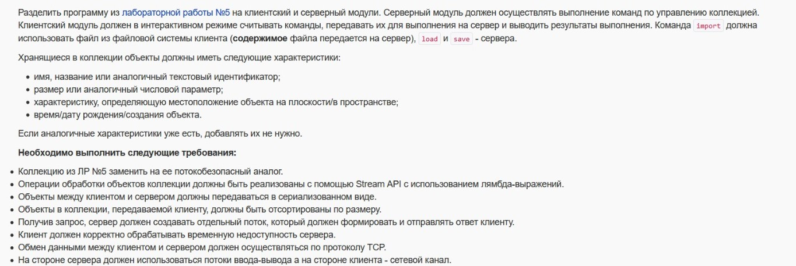

# Programming lab №4

#### Description of the subject area on which the object model is built:

>Но вдруг случилось нечто неожиданное. Изощряясь в сложных фигурах, привидение сделало чересчур маленький круг, и его одежды зацепились за люстру. Хлоп! -- старенькие простыни тут же поползли, спали с Карлсона и повисли на люстре, а вокруг нее летал Карлсон в своих обычных синих штанах, клетчатой рубашке и полосатых носках. Он был до того увлечен игрой, что даже не заметил, что с ним случилось. Он летал себе и летал, вздыхал и стонал по-привиденчески пуще прежнего. Но, завершая очередной круг, он вдруг заметил, что на люстре что-то висит и развевается от колебания воздуха, когда он пролетает мимо.  

# Programming lab №5

- in console:
    
    
    set FILE_FOR_5LAB=D:\path\to\csv\file.csv
    
    set CHARSET5=нужная_кодировка(если не указывать это, то UTF-8)

# Programming lab №6

# Programming lab №7
